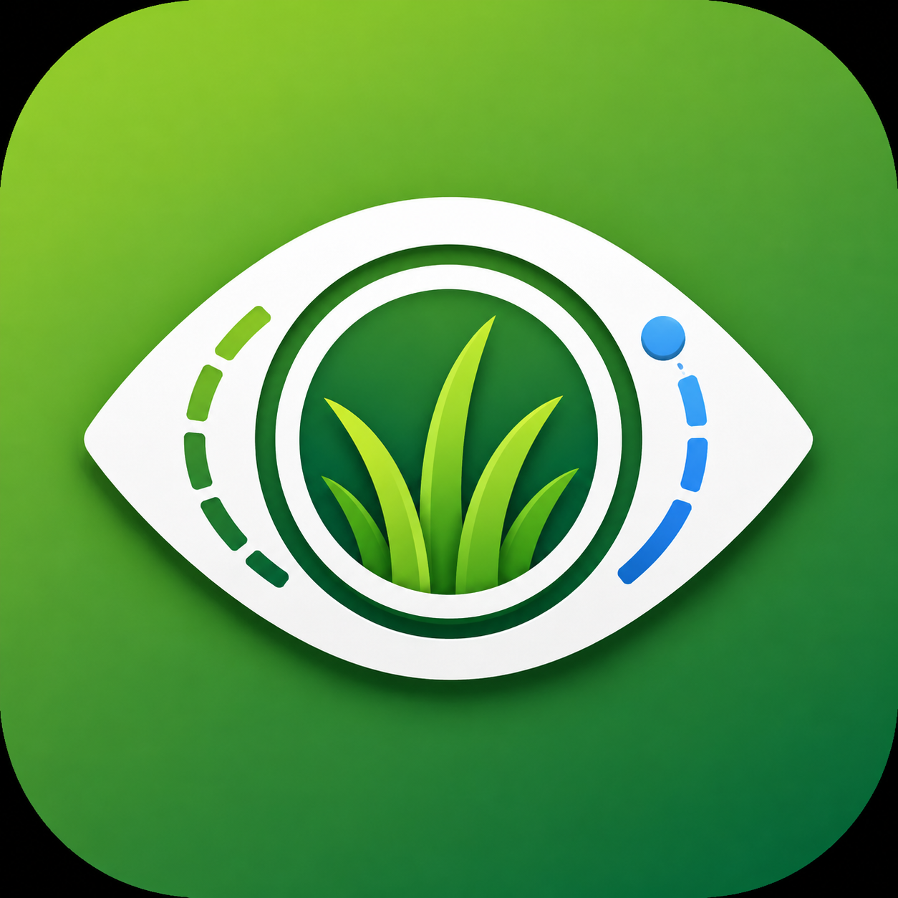
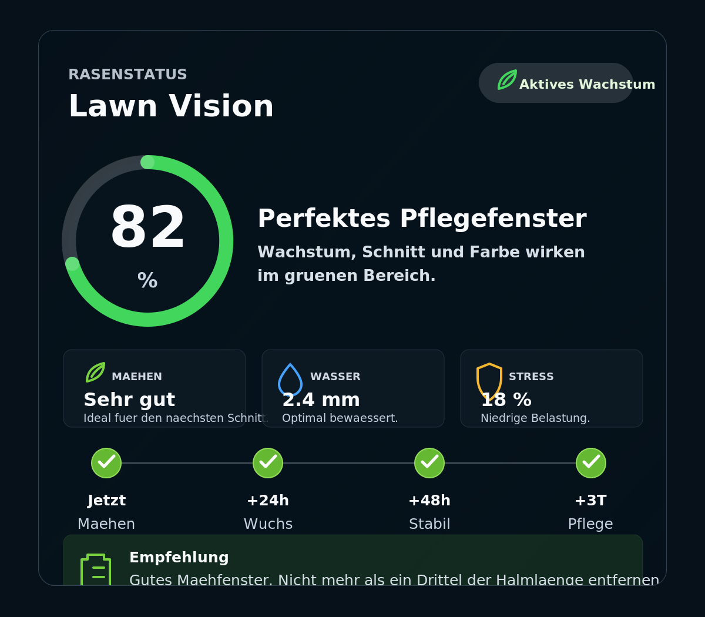

<p align="center">
  
</p>

# Lawn Vision

[](https://hacs.xyz)
[](https://github.com/schwarzbr0t/lawn-vision/releases)
[](https://github.com/schwarzbr0t/lawn-vision/actions/workflows/tests.yml)
[](https://buymeacoffee.com/kevinschwarz)

> ⚠️ **Disclaimer:** This project is "vibecoded" — built quickly and iteratively with heavy AI assistance. It has **not yet been thoroughly tested** in real-world Home Assistant deployments. Expect rough edges, breaking changes, and bugs. Use at your own risk and please report issues you run into. Contributions and test feedback are very welcome.

Lawn Vision is a Home Assistant MVP for a more visual, decision-oriented lawn
dashboard. It turns existing weather and garden entities into simple care
signals: growth phase, growth score, mowing window, water need, stress level
and a plain-language recommendation.



## What it does

- Calculates a local lawn growth score from temperature and grass type.
- Uses optional soil moisture, rain and humidity entities to refine care advice.
- Exposes Home Assistant sensors for automations and dashboards.
- Adds a custom Lovelace card that feels native to Home Assistant themes.
- Works without cloud accounts or API keys in the MVP.

## Sensors

The integration creates these sensors:

- `sensor.lawn_vision_phase`
- `sensor.lawn_vision_growth_score`
- `sensor.lawn_vision_soil_temperature`
- `sensor.lawn_vision_mean_daily_temperature`
- `sensor.lawn_vision_grassland_temperature_sum`
- `sensor.lawn_vision_growing_degree_days`
- `sensor.lawn_vision_moisture_10cm`
- `sensor.lawn_vision_moisture_20cm`
- `sensor.lawn_vision_moisture_30cm`
- `sensor.lawn_vision_mowing_condition`
- `sensor.lawn_vision_water_need`
- `sensor.lawn_vision_stress_level`
- `sensor.lawn_vision_recommendation`
- `sensor.lawn_vision_forecast_rain_risk`
- `sensor.lawn_vision_forecast_water_need`
- `sensor.lawn_vision_forecast_growth_trend`
- `sensor.lawn_vision_forecast_best_window`
- `sensor.lawn_vision_forecast_care_hint`
- `sensor.lawn_vision_forecast_slot_24h`
- `sensor.lawn_vision_forecast_slot_48h`
- `sensor.lawn_vision_forecast_slot_3d`

The three forecast slot sensors expose a `suitability` score (0–100) as
their state plus `action_code`, `action_label`, `growth_code`,
`growth_label`, `stress_code`, `stress_label`, `rain_pct`, `rain_mm` and
`temp_c` attributes. They power the Ausblick timeline of the dashboard
card.

Care guide sensors (each exposes a state plus `reason`, `next_window`,
`days_since`, `cooldown_days` attributes):

- `sensor.lawn_vision_action_mow`
- `sensor.lawn_vision_action_water`
- `sensor.lawn_vision_action_fertilize`
- `sensor.lawn_vision_action_scarify`
- `sensor.lawn_vision_action_aerate`
- `sensor.lawn_vision_action_overseed`
- `sensor.lawn_vision_next_action` – headline action for today

Action states are `do_now`, `soon`, `wait`, `skip`, `off_season`. The
`next_action` sensor returns the recommended action id (`mow`, `water`,
`fertilize`, `scarify`, `aerate`, `overseed`, or `none`).

## Inputs

Required:

- A Home Assistant weather entity, a temperature sensor, **or** the
  built-in [Open-Meteo](https://open-meteo.com/) adapter (no API key
  required, attribution: weather data by Open-Meteo).

Optional but recommended:

- Humidity sensor
- Soil moisture sensor
- Soil temperature sensor
- Mean daily temperature sensor
- Grassland temperature sum sensor (optional override; otherwise calculated
  from Open-Meteo)
- Growing Degree Days sensor (optional override; otherwise calculated from
  Open-Meteo)
- Soil moisture sensors for 10 cm, 20 cm and 30 cm depth
- Rain sensor
- Lawn area
- Grass type: cool-season or warm-season lawn

### Estimate soil values from weather

If you do not have a soil temperature or soil moisture sensor, enable
**"Estimate soil temperature & moisture from weather"** in the config /
options flow. The integration then derives:

- Soil temperature (≈ 10 cm depth) from air temperature with an
  exponential lag that mimics the thermal buffering of the ground.
- Soil moisture from a simple daily water balance: recent rain adds
  moisture, evapotranspiration driven by air temperature and (inverse)
  humidity subtracts from it.

Estimated values are clamped to realistic bands and exposed with an
`estimated: true` attribute on the corresponding sensor. A real sensor
or an Open-Meteo soil value always wins over the estimate.

### Grassland temperature sum (GTS) and Growing Degree Days (GDD)

Both metrics are accumulated internally from daily mean temperatures and
reset on January 1st each year:

- **GTS** follows the DWD formula: positive daily mean × monthly weight
  (Jan ×0.5, Feb ×0.75, Mar+ ×1.0). The 200 K threshold marks sustained
  vegetation onset and is surfaced as the `vegetation_started` attribute.
- **GDD** uses a grass-type-aware base temperature (cool-season 5.5 °C,
  warm-season 10 °C). The base is exposed via the `base_temp_c` attribute.

On the first run after upgrade the integration bootstraps the current
year from the Open-Meteo Archive API and tops it up with the forecast
endpoint's `past_days` window. Subsequent ticks only refresh the trailing
days. Both sensors expose `source`, `days_counted` and `calculated`
attributes so dashboards can show data provenance.

Setting the optional **Grassland temperature sum** or **Growing Degree
Days** entity in the config flow turns it into a manual override — the
external value then wins.

### Languages

The integration follows the Home Assistant UI language. German and
English are bundled; entity names, enum states and config-flow labels
translate automatically. Free-text states (recommendation, forecast
care hint, action reason) are emitted in the active language **and**
include stable machine-code attributes (`recommendation_code`,
`reason_code`, `next_window_code`, …) so the Lovelace card and
automations can localize them independently.

Note: the bundled Lovelace card currently renders its static UI labels
(section titles, button copy, kicker text) in German only. Free-text
sensor states forwarded from the integration still follow the active HA
language. Adding an English UI pass to the card is tracked separately.

For the care guide, the integration ships native `date` entities that
track when each task was last performed:

- `date.lawn_vision_last_mow`
- `date.lawn_vision_last_water`
- `date.lawn_vision_last_fertilize`
- `date.lawn_vision_last_scarify`
- `date.lawn_vision_last_aerate`
- `date.lawn_vision_last_overseed`

Update them from the UI or via the `date.set_value` service. The values
persist across restarts. If you prefer an `input_datetime` helper, set
its entity id in the options flow and it takes precedence over the
native journal entity.

## Manual installation for development

Copy the integration:

```bash
cp -R custom_components/lawn_vision /config/custom_components/
```

### Bundled dashboard card

The integration ships its own Lovelace card
(`custom_components/lawn_vision/www/lawn-vision-card.js`). Once the
integration is installed and a config entry is created, the card is
served at `/lawn_vision/lawn-vision-card.js` and registered automatically
as a frontend extra-JS resource. **No manual Lovelace resource entry is
needed.**

A standalone external card repository
([schwarzbr0t/lawn-vision-card](https://github.com/schwarzbr0t/lawn-vision-card))
remains available as a HACS Lovelace plugin for users who installed it
before the card moved in-tree. It tracks the bundled card 1:1 and
requires Lawn Vision integration **≥ 0.6.0** (forecast slot sensors and
the `reasons` attribute on the recommendation sensor).

Restart Home Assistant after installing the integration, add the Lawn
Vision integration via the UI, then add a manual dashboard card:

```yaml
type: custom:lawn-vision-card
title: Lawn Vision
history_days: 14
entity_phase: sensor.lawn_vision_phase
entity_growth: sensor.lawn_vision_growth_score
entity_soil_temperature: sensor.lawn_vision_soil_temperature
entity_mean_daily_temperature: sensor.lawn_vision_mean_daily_temperature
entity_grassland_temperature_sum: sensor.lawn_vision_grassland_temperature_sum
entity_growing_degree_days: sensor.lawn_vision_growing_degree_days
entity_moisture_10cm: sensor.lawn_vision_moisture_10cm
entity_moisture_20cm: sensor.lawn_vision_moisture_20cm
entity_moisture_30cm: sensor.lawn_vision_moisture_30cm
entity_mowing: sensor.lawn_vision_mowing_condition
entity_water: sensor.lawn_vision_water_need
entity_stress: sensor.lawn_vision_stress_level
entity_recommendation: sensor.lawn_vision_recommendation
entity_forecast_slot_24h: sensor.lawn_vision_forecast_slot_24h
entity_forecast_slot_48h: sensor.lawn_vision_forecast_slot_48h
entity_forecast_slot_3d: sensor.lawn_vision_forecast_slot_3d
entity_forecast_rain_risk: sensor.lawn_vision_forecast_rain_risk
entity_forecast_water_need: sensor.lawn_vision_forecast_water_need
```

All `entity_*` keys are optional and default to the standard
`sensor.lawn_vision_*` names produced by the integration. `history_days`
controls the default Verlauf range (7, 14 or 30); the user can also flip
between ranges via the segment control in the card.

## HACS packaging

This repository is a **HACS custom integration**: add it as an
*Integration* custom repository in HACS and it will install the
`lawn_vision` integration from `custom_components/`.

The Lovelace dashboard card ships **bundled with the integration** and
is auto-registered when the integration loads, so no separate HACS
plugin is required. A legacy standalone card repository
([schwarzbr0t/lawn-vision-card](https://github.com/schwarzbr0t/lawn-vision-card))
still exists for users who installed the card before it moved in-tree.

## Calculation model

The MVP is intentionally transparent. It estimates:

- Growth from a temperature curve with different optimums for cool-season and
  warm-season grasses.
- Mowing suitability from growth, moisture and wet-weather penalties.
- Water need from soil moisture or, if unavailable, heat and humidity pressure.
- Stress from heat, dryness and wet mowing risk.

These rules are not a replacement for agronomic measurements, but they create a
useful first decision layer for Home Assistant users.

## Example automations

See [examples/automations.yaml](examples/automations.yaml) for ready-made
automations that:

- Notify when the headline care action changes
- Log the last mow when a robot mower returns to its dock
- Run irrigation when the water action turns `do_now` and rain risk is low
- Send a fertilize reminder when the window opens
- Pause the mower under high stress

## Roadmap

- 7 to 14 day forecast window with per-day care plan.
- DWD/Open-Meteo source adapter for users without a weather entity.
- Lawn journal entities exposed as native sensors (currently
  `input_datetime` helpers are wired in via the options flow).
- HACS-ready split packages once the API stabilizes.
